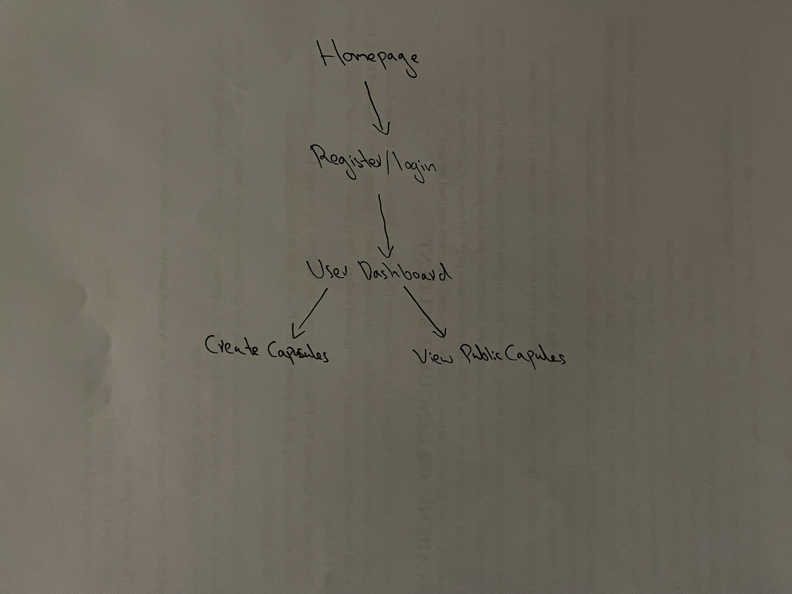

# TimeVerse

## Overview
TimeVerse is an innovative platform that redefines the way we connect through time. It enables users to create digital time capsules, encapsulating messages, images, and videos for themselves or their chosen recipients in the future. With TimeVerse, you can choose to set specific delivery dates or let the element of surprise add an extra layer of excitement. Whether it's preserving life-changing milestones, sharing heartfelt advice, or simply reliving precious memories, TimeVerse offers a seamless and personalized experience. Keep your capsules private or share them with the wider community, forging connections that transcend time itself.

## Data Model

The application will store Users, Time Capsules, and Contents

* Users can create multiple Time Capsules
* Each Time Capsule can have multiple Contents


An Example User:

```javascript
{
  username: "timeTraveler123",
  hash: "a1b2c3d4e5f6g7", // a password hash,
  capsules: [ ObjectId("abc123"), ObjectId("def456") ]
}
```

An Example Time Capsule with Embedded Contents:

```javascript
{
  creator: ObjectId("123xyz"), // a reference to a User object
  recipient: "future@example.com", // or a reference to another User object
  deliveryDate: ISODate("2023-11-01T12:00:00Z"),
  contents: {
    message: "Dear Future Me,",
    images: [
      "https://example.com/image1.jpg",
      "https://example.com/image2.jpg"
    ],
    videos: [
      "https://example.com/video1.mp4"
    ]
  }
}
```


## [Commented First Draft Schema](db.mjs) 


## Wireframes

[Wireframes](documentation/wireFrames.pdf)


## Site map



## User Stories or Use Cases

1. As a non-registered user, I can register a new account with the site.
2. As a user, I can log in to the site.
3. As a user, I can create a new time capsule.
4. As a user, I can view all of the time capsules I've created.
5. As a user, I can mark a time capsule as public or private.
6. As a user, I can view public time capsules created by other users.
7. As a user, I can delete a time capsule that I've created.
8. As a user, I can log out of the site.


## Research Topics

(__TODO__: the research topics that you're planning on working on along with their point values... and the total points of research topics listed)

* (5 points) Integrate user authentication
    * Implementing a user authentication system to allow users to create accounts, log in, and log out.
    * I'm going to be using passport for user authentication
* (3 points) Configuration Management 
    * Utilizing dotenv to manage environment-specific settings and configurations. 
* (2 points) CSS Framework or UI Toolkit
    * using tailwind.css as a CSS framework

## [Link to Initial Main Project File](app.mjs) 

(__TODO__: create a skeleton Express application with a package.json, app.mjs, views folder, etc. ... and link to your initial app.mjs)

## Annotations / References Used


